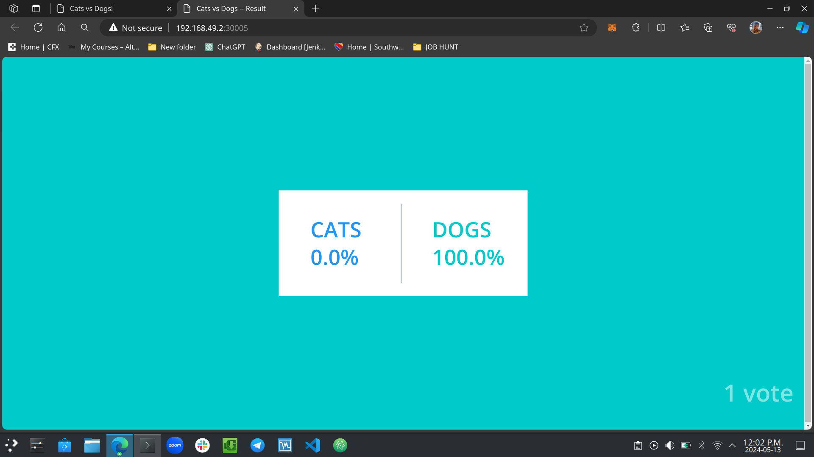
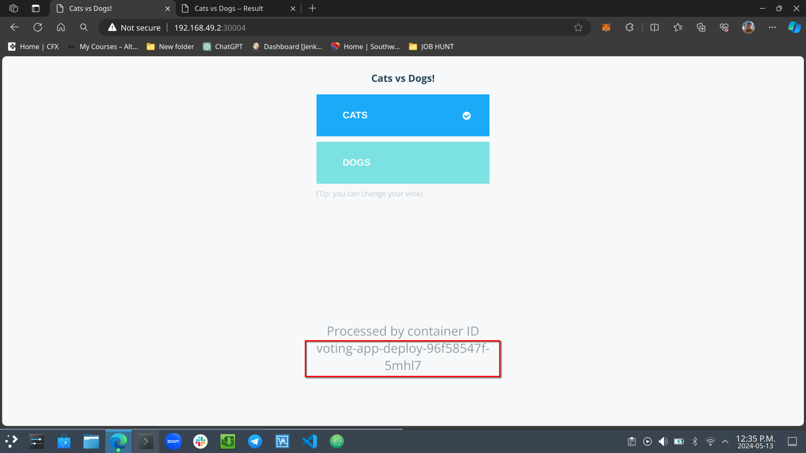

# Deploying a Voting App Using Kubernetes

This guide will walk you through deploying a voting app with five microservices using Kubernetes from Docker samples. The app consists of a web vote app (Python), Redis (message queue), a worker service (.NET), a database (PostgreSQL), and a web result app (Node.js). We will write Kubernetes deployment YAML files for each microservice, manage their deployments, expose the necessary services to the internet, and scale the deployment as needed.

This is based on the modified [example-voting-app-kubernetes](https://github.com/kodekloudhub/example-voting-app-kubernetes.git) repository from the [kodekloudhub](https://github.com/kodekloudhub) GitHub page and modified it to work on the Kubernetes cluster.

## Prerequisites

Before proceeding, ensure you have the following installed:

- [Docker](https://docs.docker.com/get-docker/)
- [Kubernetes cluster](https://kubernetes.io/docs/setup/) (Minikube was used for this setup, Docker Desktop with Kubernetes enable)
- [kubectl](https://kubernetes.io/docs/tasks/tools/install-kubectl/)

- [Git Repo](https://github.com/kodekloudhub/example-voting-app-kubernetes.git)

## Step 1: Dockerizing the Microservices

Dockerize each microservice following Docker best practices. This typically involves creating a Dockerfile for each component, building Docker images, and pushing them to a container registry.

For detailed instructions on Dockerizing each microservice, please refer to our [guide on Dockerizing Microservices](https://docs.docker.com/docker-hub/quickstart/).

## Step 2: Creating Kubernetes Deployment YAML Files

Create or download Kubernetes Deployment YAML files from the git repository for each microservice. These files describe the desired state for each microservice and instruct Kubernetes on how to manage their containers.


**YAML Format for Deployment and Service**


what the deployments and services yaml files should look like.

## Step 3: Running the Deployments

Before deploying the voting app, confirm if any services, deployments, or pods are running. You can check by running:

```bash
Copy code
kubectl get services
kubectl get deployments
kubectl get pods
```


verify if the deployments/services is already running


**Now create deployments for each microservice using**

`kubectl create -f <filename.yaml>` for each YAML file.

```bash
kubectl create -f voting-app-deploy.yaml
kubectl create -f redis-deploy.yaml
kubectl create -f worker-app-deploy.yaml
kubectl create -f result-app-deploy.yaml
kubectl create -f postgres-deploy.yaml
```


voting-app-deploy created.


redis-deploy created.


postgres-deploy created.


worker-app-deploy created.

## Step 4: Exposing the Services

Expose the necessary services to the internet using Kubernetes Services. You may need to expose services like the web vote app and web result app, while keeping others internal.

**PostgreSQL Yaml File**


**Caution:** The provided PostgreSQL deployment YAML file uses default credentials (`postgres`/`postgres`) and has security implications. This is suitable for testing and development purposes but is not recommended for production deployments. For production environments, ensure you follow best practices for securing your PostgreSQL deployment. If you need guidance on securing your PostgreSQL deployment for production, feel free to reach out to me on LinkedIn.

## Apply Services for exposing the web voting-app

Create or apply the Service YAML files:

```bash
kubectl create -f voting-app-service.yaml
kubectl apply -f redis-service.yaml
kubectl create -f postgres-service.yaml
kubectl apply -f result-app-service.yaml
```


voting-app-service running


redis-service running


postgres-service running


result-app-service running

## Step 5: Accessing the Voting App

Use Minikube's service command to get the URL for accessing the voting app and result app.

```bash
minikube service <service-name> --url
```

Replace <service-name> with the name of the service you want to access (e.g., voting-app, result-app). This command will provide you with the URL to access the specified service.


Output the voting app and result app using the provided URLs.


voting-app webpage


result-app webpage


## Step 6: Scaling the Deployment

To scale the deployment, use the `kubectl scale` command with the `--replicas` flag.

```bash
kubectl scale deploy <deployment-name> --replicas=<number-of-replicas>
```

Replace <deployment-name> with the name of the deployment you want to scale and <number-of-replicas> with the desired number of replicas.

**For example, to scale from 1 to 7 replicas for the voting-app-deployment:**

```bash
kubectl scale deployment voting-app-deploy --replicas=7
```


The newly created Pods

**And to scale from 7 to 2 replicas:**

```bash
kubectl scale deployment voting-app-deploy --replicas=2
```

Terminating 5 Pods


Running 2 Pods

**And scaling both voting-app-deploy and result-app-deploy to 3 replicas:**

```bash
kubectl scale deploy voting-app-deploy --replicas=3
kubectl scale deployment result-app-deploy --replicas=3
```

Setting voting-app and result-app deployments to 3 replicas.

This commands adjusts the number of replicas running for the specified deployment, allowing you to dynamically scale your application based on demand.

## Observing Multiple Pods Being Used to Vote

As you vote from different browser windows/tabs, Kubernetes will distribute the requests among the available pods of the voting app deployment. You can verify this by checking the pod logs or using Kubernetes Dashboard to monitor pod activity.

By following these steps, you can demonstrate the functionality of the voting app, view the voting results, and observe multiple pods being utilized for voting simultaneously.


voting using pod voting-app-deploy-96f58547f-5mhl7


voting using pod voting-app-deploy-96f58547f-ptwpl


voting from two seperate browser and seein the votes

# Conclusion

Congratulations on successfully deploying the voting app using Kubernetes! By following the steps outlined in this guide, you have learned how to deploy a microservices-based application on a Kubernetes cluster. You have Dockerized each microservice, written Kubernetes Deployment YAML files, managed deployments, exposed services to the internet, and scaled the deployment as needed.

You have also explored the functionality of the voting app, viewed voting results, and observed multiple pods being utilized for voting simultaneously. This demonstrates the power and scalability of Kubernetes in managing containerized applications.

Feel free to further explore Kubernetes features, such as using Kubernetes Dashboard to monitor pod activity and resource utilization, implementing autoscaling for better resource management, and integrating additional services to enhance the functionality of your application.


